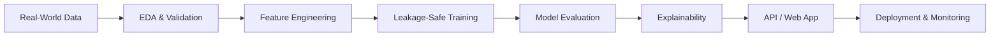

## About Me

I'm **Fahim**, a Computer Science undergraduate at **East West University, Bangladesh**, passionate about turning data into intelligent, usable products.

My work spans **predictive modeling, explainable AI, computer vision, and end-to-end deployment**. I've built projects across sports, finance, healthcare, customer analytics, and more. I'm now exploring **LLMs, agentic AI, MLOps, and cloud-native applications** to take machine learning beyond notebooks.

- Currently building: **production-oriented ML applications and reproducible pipelines**
- Currently learning: **LLMs, Deep Learning, Docker, MLOps, and cloud deployment**
- Interested in: **ML engineering, applied AI research, and AI automation**
- Philosophy: **Build it. Validate it. Explain it. Ship it.**

> *Every dataset has a story. I just help it speak.*

## Tech Stack

**Programming & Web**

**Machine Learning, Deep Learning & Data**

**Backend, Databases & Deployment**

**Development & Creative Tools**

**Also working with:** XGBoost · LightGBM · CatBoost · Streamlit · SHAP · LIME · Matplotlib · Seaborn · SQL · REST APIs

## Featured Projects

| Project | What it does | Key technologies |
| :--- | :--- | :--- |
| [IPL Boundary Prediction](https://github.com/samifahim07/IPL-Boundary-Prediction) | Predicts the likelihood of a boundary using ball-by-ball match context. | Python, LightGBM |
| [Bank Credit Score Prediction](https://github.com/samifahim07/Bank_Credit_Score-Prediction-) | Classifies customer credit-score categories from financial attributes. | Python, Scikit-learn, Pandas |
| [Laptop Price Predictor](https://github.com/samifahim07/Laptop-Price-predictor) | Estimates laptop prices from hardware specifications. | Python, Random Forest |
| [Customer Churn Prediction](https://github.com/samifahim07/AI-Powered-Customer-Churn-Prediction-and-High-Risk-Customer-Retention-Analysis) | Identifies customers with elevated churn risk and supports retention analysis. | Python, XGBoost, EDA |
| [Titanic ML Comparative Study](https://github.com/samifahim07/Surviving-the-Algorithm-A-Comparative-ML-Study-of-Classification-Models-Using-Titanic-Dataset) | Compares multiple classification approaches on the Titanic dataset. | Scikit-learn, Python |
| [Deep Learning Image Processing](https://github.com/samifahim07/Basic-Image-processing-using-Deep-learning) | Explores image-processing tasks with deep learning. | TensorFlow, Keras |

> Explore more experiments and applications in my [GitHub repositories](https://github.com/samifahim07?tab=repositories).

## Engineering Interests

## GitHub Analytics

## Let's Connect

I'm interested in **AI/ML internships, research collaborations, open-source contributions, and opportunities to build impactful AI products**.

**If a project helps you, consider leaving a star. Thanks for stopping by!**

