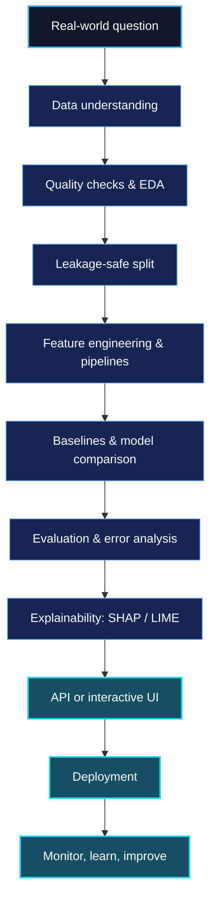

<div align="center">


### Machine Learning · Deep Learning · Explainable AI · AI Engineering

**From raw data to decisions people can actually use.**

[**GitHub**](https://github.com/samifahim07) · [**Kaggle**](https://www.kaggle.com/fahimabrarsami) · [**Hugging Face**](https://huggingface.co/fahimlabs) · [**Email**](mailto:asamifahim007@gmail.com)

</div>

---

## `01 / THE PERSON BEHIND THE MODELS`

Hey, I'm **Fahim** — a Computer Science undergraduate at **East West University, Bangladesh**. I love the space where **data, intelligent algorithms, and useful software** meet.

I've explored machine learning across sports, finance, customer analytics, healthcare, and computer vision. My focus is evolving from *training accurate models* to *building reliable AI systems*: clear validation, meaningful explanations, accessible interfaces, and real deployment.

> **My philosophy:** Build it. Validate it. Explain it. Ship it.
>
> *“Every dataset has a story. I just help it speak.”*

## `02 / AN AI ENGINEER'S TERMINAL`

```text
fahim@ai-lab:~$ whoami
  Computer Science Undergraduate | Applied AI Builder

fahim@ai-lab:~$ cat interests.txt
  Machine Learning       > Prediction & decision support
  Deep Learning          > Computer vision & neural networks
  Explainable AI         > SHAP, LIME & interpretability
  AI Applications        > APIs, interactive apps & deployment
  Next frontier          > LLMs, agentic AI & MLOps

fahim@ai-lab:~$ echo $MISSION
  "Make machine learning understandable, useful, and accessible."
```

## `03 / TOOLKIT`

<div align="center">

**Programming & Web**


**Machine Learning, Deep Learning & Data**


**Backend, Database & Deployment**


**Development & Creative Tools**


</div>

**Additional tools:** `XGBoost` · `LightGBM` · `CatBoost` · `Streamlit` · `SHAP` · `LIME` · `Matplotlib` · `Seaborn` · `SQL` · `REST APIs`

## `04 / HOW I THINK ABOUT AI SYSTEMS`

<!-- Native GitHub Mermaid diagram. No analytics API, token, or refresh needed. -->



## `05 / PROBLEMS I LIKE SOLVING`

| Area | The questions that interest me |
|:--|:--|
| **Predictive Intelligence** | Can historical signals support useful future decisions? |
| **Explainable Machine Learning** | Why did the model make this prediction? |
| **Computer Vision** | What patterns can neural networks extract from images? |
| **AI for Everyday Life** | How can prediction tools become accessible web applications? |
| **Responsible ML Engineering** | Is the model evaluated fairly, reproducibly, and without leakage? |
| **Generative & Agentic AI** | How can LLMs work with tools and structured knowledge? |

## `06 / ENGINEERING PRINCIPLES`

```text
[01] PROBLEM FIRST       A useful question matters more than a fancy model.
[02] TRUST THE SPLIT     Keep training and evaluation honestly separated.
[03] COMPARE BASELINES   Complexity must earn its place.
[04] EXPLAIN DECISIONS  Understand errors and feature influence.
[05] BUILD FOR HUMANS   A model is more useful when people can use it.
[06] KEEP ITERATING     Every experiment should teach something.
```

## `07 / EXPLORATION LAB`

<details>
<summary><b>01 — Large Language Models & Agentic AI</b></summary>

<br>

Exploring embeddings, retrieval-augmented generation (RAG), prompting, tool calling, and AI-powered workflows.

</details>

<details>
<summary><b>02 — Deep Learning & Computer Vision</b></summary>

<br>

Working with neural networks, transfer learning, image classification, training strategies, and evaluation.

</details>

<details>
<summary><b>03 — Explainability & Reliable Evaluation</b></summary>

<br>

Interested in SHAP, LIME, imbalanced learning, calibration, failure analysis, and leakage-safe pipelines.

</details>

<details>
<summary><b>04 — Deployment & MLOps</b></summary>

<br>

Learning how to move beyond notebooks using Flask, FastAPI, Docker, GitHub Actions, cloud services, and model monitoring.

</details>

## `08 / LET'S BUILD SOMETHING USEFUL`

Open to **AI/ML internships, research collaborations, open-source learning, and practical AI products**.

<div align="center">

**[Explore my repositories](https://github.com/samifahim07?tab=repositories)** &nbsp;·&nbsp; **[See my Kaggle work](https://www.kaggle.com/fahimabrarsami)** &nbsp;·&nbsp; **[Visit Hugging Face](https://huggingface.co/fahimlabs)** &nbsp;·&nbsp; **[Get in touch](mailto:asamifahim007@gmail.com)**

---

*Curiosity → Experiments → Understanding → Impact*


</div>
