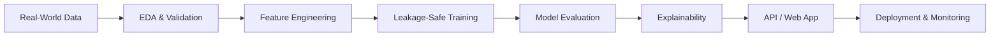

## About Me

I'm **Fahim**, a Computer Science undergraduate at **East West University, Bangladesh**, passionate about turning data into intelligent, usable products.

My work spans **predictive modeling, explainable AI, computer vision, and end-to-end deployment**. I've built projects across sports, finance, healthcare, customer analytics, and more. I'm now exploring **LLMs, agentic AI, MLOps, and cloud-native applications** to take machine learning beyond notebooks.

- Currently building: **production-oriented ML applications and reproducible pipelines**
- Currently learning: **LLMs, Deep Learning, Docker, MLOps, and cloud deployment**
- Interested in: **ML engineering, applied AI research, and AI automation**
- Philosophy: **Build it. Validate it. Explain it. Ship it.**

> *Every dataset has a story. I just help it speak.*

## Tech Stack

**Programming & Web**

**Machine Learning, Deep Learning & Data**

**Backend, Databases & Deployment**

**Development & Creative Tools**

**Also working with:** XGBoost · LightGBM · CatBoost · Streamlit · SHAP · LIME · Matplotlib · Seaborn · SQL · REST APIs

## Engineering Interests

## GitHub Contribution Streak

## AI Engineering Playground

### How I Build Intelligent Systems

| Phase | What I Focus On |
|:--|:--|
| **Discover** | Define a useful problem and audit data quality |
| **Prepare** | Clean data, engineer features, and prevent leakage |
| **Experiment** | Build baselines, compare models, and tune carefully |
| **Explain** | Interpret predictions with SHAP, LIME, and error analysis |
| **Ship** | Build an API or interactive app and deploy it |
| **Improve** | Track feedback, monitor performance, and iterate |

## Currently Exploring

<b>Large Language Models & Agentic AI</b>

 
Prompt engineering, retrieval-augmented generation (RAG), embeddings, tool use, and AI-powered workflows.

<b>Deep Learning & Computer Vision</b>

 
Transfer learning, image classification, neural-network training, and robust evaluation.

<b>Deployment & MLOps</b>

 
FastAPI/Flask services, Docker fundamentals, CI/CD with GitHub Actions, model versioning, and cloud deployment.

## Open to Building Together

---

## Let's Connect

I'm interested in **AI/ML internships, research collaborations, open-source contributions, and opportunities to build impactful AI products**.

**If a project helps you, consider leaving a star. Thanks for stopping by!**

